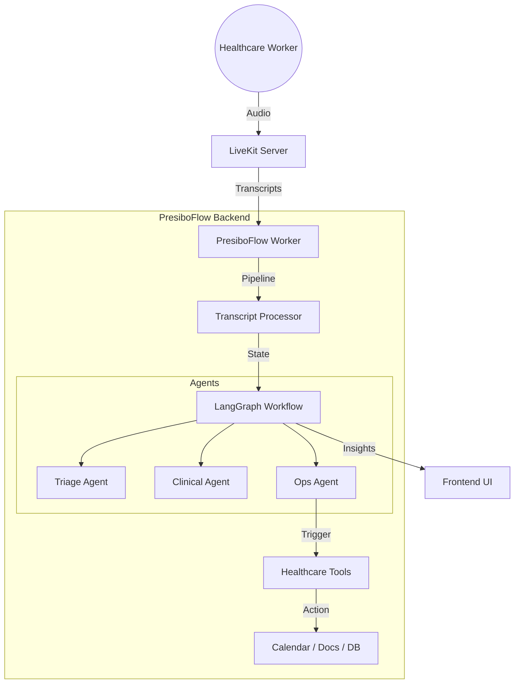

# PresiboFlow Architecture

PresiboFlow is designed as a modular, event-driven framework for real-time healthcare automation.

## System Overview

## Core Components

### 1. Voice Pipeline (`presiboflow.core`)
Uses **LiveKit Agents** to establish a WebRTC connection. It handles Voice Activity Detection (VAD) and Speech-to-Text (STT). Final transcripts are fed into the processing engine.

### 2. Multi-Agent Orchestration (`presiboflow.graph`)
Powered by **LangGraph**. A stateful graph manages the flow of information between specialized agents:
- **Triage**: Categorizes the intent.
- **Clinical**: Extracts medical data (vitals, symptoms).
- **Ops**: Converts intents into administrative actions.

### 3. Agentic Tools (`presiboflow.tools`)
Encapsulated logic for interacting with external systems:
- **Calendar**: Syncs with scheduling systems.
- **Docs**: Generates structured reports via Google Docs API.
- **Metrics**: Logs time-series health data.

### 4. Privacy & Sovereignty
Designed for **on-premise deployment**. PresiboFlow supports local LLMs via Ollama to ensure sensitive patient data (PHI) never leaves the hospital's network unless explicitly configured.

## Data Flow
1. **Audio Input**: Dr. Tunde starts a consultation.
2. **STT**: "Schedule follow-up for Mr. AB next Monday."
3. **Triage Agent**: Detects "scheduling" intent.
4. **Ops Agent**: Calls `calendar_tool`.
5. **UI Update**: Frontend displays "Calendar Event Created" notification.
